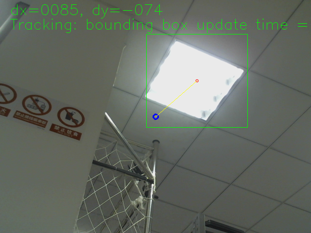

## About The Project

This project is based on a small sample of [DJI Onboard SDK]([dji-sdk/Onboard-SDK: DJI Onboard SDK Official Repository (github.com)](https://github.com/dji-sdk/Onboard-SDK)), the original version of this sample is implemented under linux environment rather than ros. This project uses KCF algorithms to track image target with bounding boxes. 

## Getting Started

### Prerequisites

 - Ros

You need to install ros first. Install instruction can be found at: http://wiki.ros.org/ROS/Installation. I just tested ROS kinetic version.

### Installation

1. create your workspace
   
   ```sh
   mkdir -p you_ws/src
   cd you_ws/src
   ```
   
2. Clone the repo and complie

   ```sh
   git clone https://github.com/potBagMeat/kcf_tracker_ros.git
   cd ..
   catkin_make
   ```

3. download camera package of ros.
   ```sh
   sudo apt-get install ros-kinetic-usb-cam
   ```


## Usage

### Change camera

If you want to try other camera rather than usb camera. You should change ros topic name in **target_tracking.cpp**.

Firstly,

```sh
rostopic list
```

Find your topic and copy your topic name.

In **target_tracking.cpp**

change

```c++
image_transport::Subscriber imageSubscriber = it.subscribe("/usb_cam/image_raw",10,imageCallBack);
```

to

```c++
image_transport::Subscriber imageSubscriber = it.subscribe("you_topic_name",10,imageCallBack);
```

and don't forget to catkin_make.

### Basic use

In order to run this project.

1. Run camera node.

```sh
roslaunch usb_cam usb_cam-test.launch
```

2. Run KCF tracker.

```sh
rosrun kcf_target_tracker kcf_target_tracker
```

and you will see 



## License

Distributed under the MIT License. See `LICENSE` for more information.


## Contact

Xiaofeng Lin - linxiaof@umich.edu


