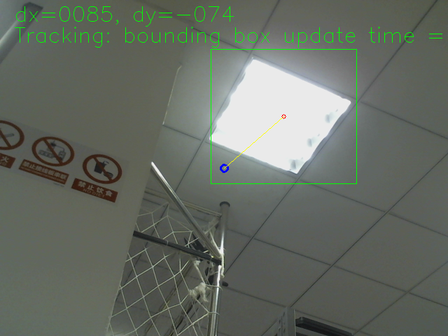

## 在ROS环境下使用KCF算法追踪图像

项目是基于dji的[DJI Onboard SDK]([dji-sdk/Onboard-SDK: DJI Onboard SDK Official Repository (github.com)](https://github.com/dji-sdk/Onboard-SDK))中关于云台相机控制的例子（已经被抛弃/obsoleted），但是大疆是直接在linux下执行的，并没在ros环境下开发，为了后续开发的方便（后续我自己也得做云台控制），我将其做了一些调整，让其能在ROS环境中运行。

## 开始

### 依赖

 - Ros

整个项目是在ROS环境下运行的，需要先安装[ROS]( http://wiki.ros.org/ROS/Installation)

### 安装

1. 创建工作空间

   ```sh
   mkdir -p you_ws/src
   cd you_ws/src
   ```

2. 下载和编译

   ```sh
   git clone https://github.com/potBagMeat/kcf_tracker_ros.git
   cd ..
   catkin_make
   ```

3. 下载摄像头驱动

   ```sh
   sudo apt-get install ros-kinetic-usb-cam
   ```

## 使用

### 更换相机

如果想更换订阅的相机消息，需要在**target_tracking.cpp**中改.

首先，启动你的相机节点并且

```sh
rostopic list
```

找到相机的话题并复制。

在**target_tracking.cpp**中，更改

```c++
image_transport::Subscriber imageSubscriber = it.subscribe("/usb_cam/image_raw",10,imageCallBack);
```

为

```c++
image_transport::Subscriber imageSubscriber = it.subscribe("you_topic_name",10,imageCallBack);
```

最后在重新编译，使用。

### 基本的使用方法

1. 运行相机节点

```sh
roslaunch usb_cam usb_cam-test.launch
```

2. 运行KCF

```sh
rosrun kcf_target_tracker kcf_target_tracker
```

会出现类似结果



## License

Distributed under the MIT License. See `LICENSE` for more information.


## 联系

Xiaofeng Lin - linxiaof@umich.edu

